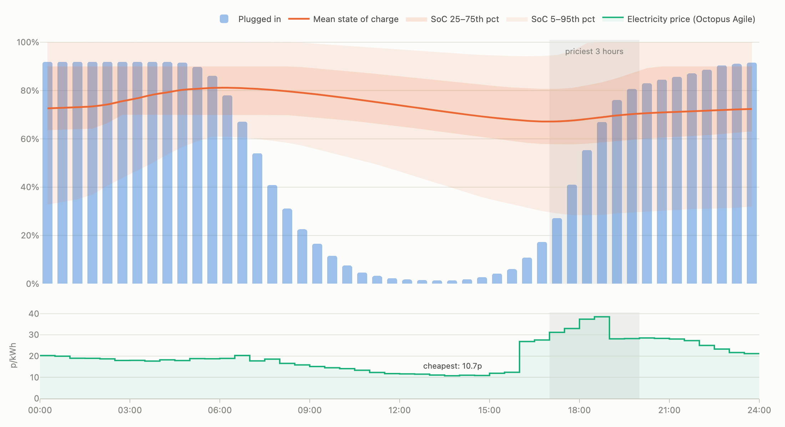

# EV Driver Behaviour Simulator

An agent-based simulator of electric vehicle driver behaviour: when drivers plug in,
the state of charge of their battery when they do, and how these vary across a
population of driver archetypes.



## Quickstart

With [uv](https://docs.astral.sh/uv/):

```sh
uv run streamlit run streamlit_app.py
```

With Docker:

```sh
docker build -t axolotl .
docker run -p 8501:8501 axolotl
```

Then open http://localhost:8501.

## What it does

Six driver **archetypes** (from the provided archetype table, itself derived from
Centre for Net Zero's 2022 Intelligent Octopus study) describe behavioural
patterns: annual mileage, battery, charger power, plug-in/out times, charging
cadence, and charging strategy.

Each **agent** is one driver sampled from an archetype with individual variation
(Monte Carlo): habitual plug-in/out times (weekends shift earlier-in/later-out with
more spread), mean daily mileage, a charging cadence, and a personal charging
target (70/80/90/100%, following the report's preference distribution).

The **engine** advances all agents through 30-minute timesteps in a deliberately
explicit loop: cars leave home at their plug-out time, deplete a day of driving
drawn from a right-skewed (gamma) distribution — many ordinary days, occasional
long trips, never negative — across the away window, return and plug in on their
charging cycle,
then charge — immediately at full power for most archetypes, or (for the
Intelligent Octopus archetype) only in the cheapest half-hours that still reach the
target by the ready-by deadline, priced against **live Octopus Agile data** with a
synthetic fallback when the API is unreachable.

The **dashboard** has two views. The population chart pools all agents and days
into a typical day (the first two simulated days are discarded as burn-in, while
agents settle from their arbitrary initial state): bars for the share of the
fleet plugged in, a line and percentile bands for the state-of-charge
distribution, and an aligned electricity-price panel with the priciest hours of
the day shaded. The individual-driver chart shows any single agent's SoC
trajectory and plug-in sessions across consecutive days — the agent-level
output the population aggregates are built from, and a direct way to
sanity-check behaviour one driver at a time. Both views share the same
aligned price panel, so smart charging can be read against price at either
level.

## Design decisions

- **Readable loop over vectorisation.** The engine is a plain
  timestep-over-agents loop; every rule reads as one sentence ("the car was
  plugged in, below target, so it charged 7 kW for half an hour"). A full default
  run (1,000 agents × 4 weeks) takes ~0.3 s, so there was nothing to buy with
  numpy vectorisation except opacity.
- **Population realism from two layers of randomness.** Who the driver is
  (sampled once per agent) vs what they do each day (sampled daily). Percentile
  bands in the chart are meaningful because agents genuinely differ; setting the
  spread slider to 0 collapses the population back to the deterministic archetype
  table.
- **Charging cadence is a regular cycle, not a daily coin flip.** The obvious
  alternative — plugging in each day with probability 0.2 — was tried and
  rejected: its geometric gap lengths regularly run batteries to empty and bias
  plug-in SoC far above the table's values. "Every 5th day, random phase"
  reproduces the table exactly and strands nobody.
- **Recapitulation as tests.** The table's derived columns (kWh per plug-in,
  expected plug-in SoC, charge duration) and the report's population statistics
  are pytest assertions with explicit tolerances — the simulator demonstrably
  reproduces the observations it was calibrated on (e.g. simulated Intelligent
  Octopus mean plug-in SoC 0.54 vs the report's measured 52% median).
- **One honest axis.** Plugged-in share and state of charge are both
  percentages, so they share a single 0–100% axis. Price is a different unit and
  gets its own panel on the same time axis rather than a second y-axis.
- **UI-agnostic core.** The `axolotl` package knows nothing about Streamlit; the
  dashboard is a thin caching layer over `run_simulation` +
  `time_of_day_profile`. Wrapping the same functions in an HTTP API (the models
  are already pydantic) would be a ~30-line exercise — deliberately left out for
  simplicity.

## Assumptions

- Charging strategy is inferred, not given: the archetype table has no strategy
  column, so only the Intelligent Octopus archetype smart-charges (automated
  cheapest-slot scheduling is what that product does); all others charge
  immediately on plug-in.
- Drivers charge only at home; no public or workplace charging.
- One plug event per day at most, at the agent's habitual arrival time.
- Driving depletes the battery uniformly across the away window (no trip
  structure within the day).
- Charging is linear at full charger power up to the target (no CC/CV taper near
  100%).
- No seasonality: a single annual mileage and efficiency figure year-round.
- Weekend behaviour differs in *timing* (arrive ~1h earlier, leave ~2h later,
  more spread — report Figs. 4–5) but not energy, matching the report's finding
  that weekend charge demand is similar to weekdays. A `weekend_miles_multiplier`
  exists for exploring mileage-shifted patterns (see the illustrative "Weekend
  tripper" preset).
- Agile prices are averaged over the last 28 days into a typical
  time-of-day profile (region C/London; regional differences shift the level,
  not the shape that scheduling cares about).

## Where the time went

Most effort: the behavioural model (making the population recapitulate both the
archetype table and the report's distributions, with the failure modes of naive
approaches documented in code comments) and the chart. Deliberately kept small:
the Streamlit layer (thin by design), packaging, and anything the data provided
didn't support — inventing unobserved parameters felt worse than documenting the
assumption.

## Potential extensions

In rough order of value: away-from-home charging for long trips; second/daytime
plug events (the report shows short midday sessions, especially at weekends);
charge taper near full; seasonal efficiency; an HTTP API over the core package.

## Development

```sh
uv sync                  # install (Python 3.13+)
uv run pytest            # 58 tests
uv run ruff check .      # lint
uv run ruff format .     # format
uv run ty check          # type check
```

CI runs lint, format, type checks, and tests on every PR. The project layout:

```
src/axolotl/
├── archetypes.py   # frozen pydantic models + the six presets
├── agent.py        # per-agent Monte Carlo sampling
├── config.py       # validated simulation config
├── engine.py       # the timestep loop
├── prices.py       # Octopus Agile client + synthetic fallback
├── aggregate.py    # population time-of-day profiles (polars)
└── chart.py        # the Plotly figure
streamlit_app.py    # the dashboard
```
